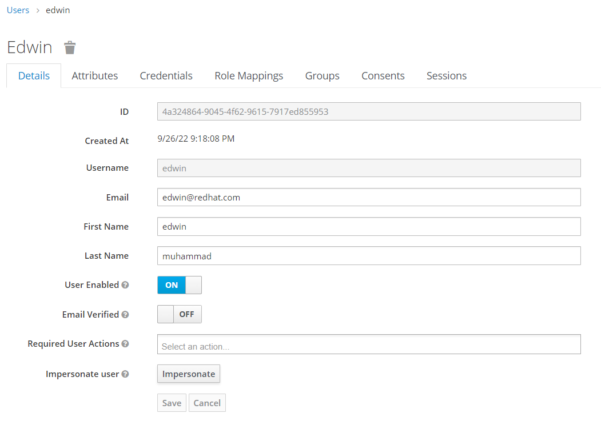
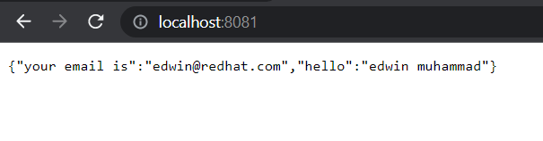

# Spring Boot 3, Spring Security, and Keycloak

## Purpose
A sample java code to demonstrate a Spring Boot 3 integration with Keycloak 17. It utilize Keycloak login page, and fetch a user's attribute based on Keycloak user profile. 

## Version
- Spring Boot 3.0.4
- Keycloak 17
- Red Hat OpenJDK 17

## Screenshots
Keycloak User Profile



JSON Response reading Keycloak Profile



## Blog Post
Explanation of this code can be seen on below `Red Hat Developer` article, 
```
https://developers.redhat.com/articles/2023/07/24/how-integrate-spring-boot-3-spring-security-and-keycloak
```

## Disclaimer
```
This code is provided "as is" without any guarantee whatsoever. 
Feel free to fork, add, remove, change, or do whatever you want with it. 
```